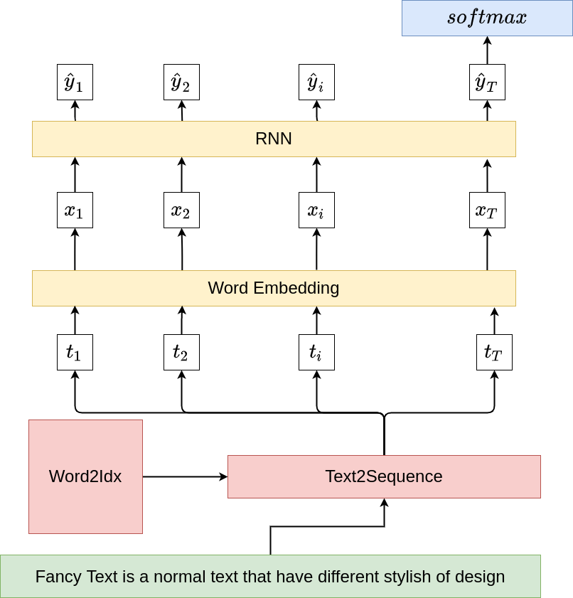
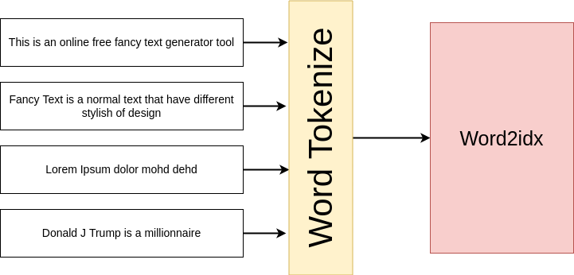

# Text Classification With PyTorch

Created: May 14, 2022 10:24 PM
Status: In Progress
tags: nlp, reccurent-models, text-classification

# Learning Objectives

- Be able to implement *Reccurent Neural Networks on any text data*
- Use **PyTorch** RNN modules ****and implementing them from scratch
- *Understand the challenges of training RNN Architectures*

# Text Classification: IMDB, Yelp, AG News

## Materials

- **Pytorch RNN:**

[https://pytorch.org/docs/stable/generated/torch.nn.RNN.html#torch.nn.RNN](https://pytorch.org/docs/stable/generated/torch.nn.RNN.html#torch.nn.RNN)

- **NUY Deep Learning** (**Alfcnz**)**: Training RNN**

[https://youtu.be/5KSGNomPJTE?t=2322](https://youtu.be/5KSGNomPJTE?t=2322)

## Code Snippets

> *RNN Cell*
> 

```python
import torch
import torch.nn as nn

class RNNCell(nn.Module):
	def __init__(self, in_features, hidden_size):
			self.hidden_size = hidden_size
			self.wx = nn.Parameter(torch.randn(in_features, hidden_size))
			self.wh = nn.Parameter(torch.randn(hidden_size, hidden_size))
			self.bias = nn.Parameter(torch.zeros(hidden_size))
	def forward(self, xt, ht_prev):
			ht = torch.tanh(torch.matmul(xt, self.wx) + torch.matmul(ht_prev, self.wh) + self.bias)
			return ht
```

## Approach 📝

The first phase is text preprocessing, which involves extracting a **vocabulary** (python dict) and using it to convert text to a **sequence** of integers (integres are indices for words). The sequence is then run through an **Embedding layer** to obtain a **word embedding** for each word (token). The embedding is processed via a **Reccurent Layer** (RNN, LSTM, or GRU), and the final output of this layer is used to make predictions.

### Figures



Making predictions with **RNN** 😇



text pre-processing

### Equations

### RNN For Text Classification

$$
h_t=tanh(\mathit{W_{h}h_{t-1}+b_{h}+\mathit{W_{x}x_{t}+b_x}})
$$

$$
\hat{y}_{\mathit{T}}=softmax( \mathit{W_y}h_{T})
$$

### LSTM Cell

$$
\mathcal{f}_t = \sigma_f(\mathit{W_f} * x_t + \mathit{U_f}*h_{t-1} + b_f)
$$

$$
\mathit{i}_t = \sigma_i(\mathit{W_i}*x_t+\mathit{U_i}*h_{t-1} + b_i)
$$

$$
\mathit{o_t} = \sigma_g(\mathit{W_o}*x_t+\mathit{U_o}*h_{t-1}+b_0)
$$

$$
c_t^{\prime} = \sigma_c(\mathit{W_c}*x_t+\mathit{U_c} * h_{t-1} + b_c)
$$

$$
c_t = f_t \odot c_{t-1} + i_t \odot c_t^{\prime}
$$

$$
h_t = o_t \odot \sigma_c(c_t)
$$

## Experiments and Results (AG_NEWS Dataset)

| model | Embedding dimension | Hidden dimension | Accuracy |
| --- | --- | --- | --- |
| LSTM | 150 | 128 |  |
| GRU |  |  |  |
| RNN | 300 | 300 | 47.32 % |
| WORD2VEC+MLP |  |  |  |